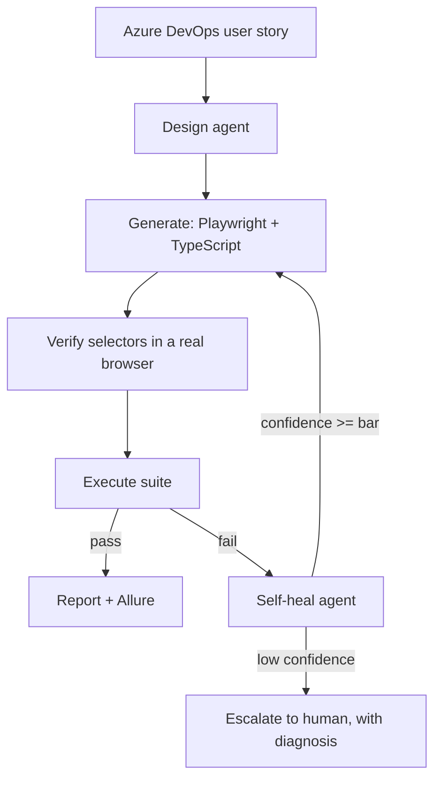
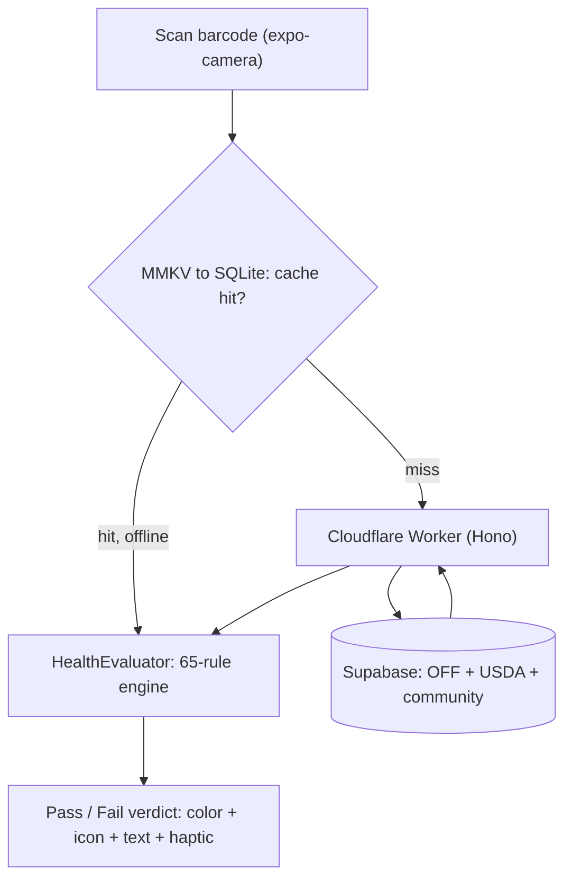

<!--
  ┌─────────────────────────────────────────────────────────────────────────┐
  │  This is a GitHub PROFILE README (repo: vkucherko/vkucherko).            │
  │  The animated hero + monogram are hand-authored SVGs in /assets — they   │
  │  animate on github.com (NOT in VS Code preview / mobile app). Verify on   │
  │  the real site. To update an SVG and bust GitHub's image cache, RENAME    │
  │  the file (query strings don't reliably bust committed relative paths).   │
  └─────────────────────────────────────────────────────────────────────────┘
-->

  

<h3 align="center">I build quality systems for software and, increasingly, with AI.</h3>

Agentic testing that designs, verifies, executes, and self-heals end-to-end suites, from a written requirement to a green, trustworthy build.

 

  
  

  
  &nbsp;&nbsp;
  
  &nbsp;&nbsp;
  

  <a href="#build"><picture><source media="(prefers-color-scheme: dark)" srcset="assets/ui/cta-build.dark.svg" /></picture></a>
  <a href="#headed"><picture><source media="(prefers-color-scheme: dark)" srcset="assets/ui/cta-headed.dark.svg" /></picture></a>
  <a href="#impact"><picture><source media="(prefers-color-scheme: dark)" srcset="assets/ui/cta-impact.dark.svg" /></picture></a>
  <a href="#featured"><picture><source media="(prefers-color-scheme: dark)" srcset="assets/ui/cta-featured.dark.svg" /></picture></a>
  <a href="#stack"><picture><source media="(prefers-color-scheme: dark)" srcset="assets/ui/cta-stack.dark.svg" /></picture></a>
  <a href="#talk"><picture><source media="(prefers-color-scheme: dark)" srcset="assets/ui/cta-talk.dark.svg" /></picture></a>

<picture><source media="(prefers-color-scheme: dark)" srcset="assets/ui/div-left.dark.svg" /></picture><picture><source media="(prefers-color-scheme: dark)" srcset="assets/ui/div-right.dark.svg" /></picture>

<h2>&nbsp;&nbsp;<picture><source media="(prefers-color-scheme: dark)" srcset="assets/glyph/build.dark.svg" /></picture>&nbsp;&nbsp;What I Build Now</h2>

 

I spent 9+ years making test automation reliable, including Playwright, Selenium, API, and CI/CD. Now I engineer the layer above it: **AI systems that own testing end-to-end**, treated as real software (evals, instrumentation, confidence gates) rather than a prompt trick.

- **A requirement becomes a suite autonomously.** A multi-agent loop turns a plain-language user story into a designed, generated, executed, and self-healed Playwright + TypeScript suite. It drives a *real browser to verify selectors before it writes a single assertion*.
- **Self-healing that's gated, not magic.** When a selector drifts, an agent proposes a patch, re-verifies it against the live DOM, and applies it **only above a confidence bar**; otherwise it escalates to a human *with a diagnosis*, not just a red X.
- **Every run is a readable timeline.** Per-step tool calls, retries, and outcomes are logged as a trajectory, so a failure is an inspectable sequence — not a black box.
- **Grounded in the product.** Requirements and domain context are retrieved (RAG) so generated tests reflect *intended behavior*, not just whatever the DOM happens to expose.

Multi-agent LLM orchestration · Claude Opus + tool-calling · MCP / Chrome DevTools MCP · Playwright · TypeScript · Azure DevOps

<picture><source media="(prefers-color-scheme: dark)" srcset="assets/ui/div-left.dark.svg" /></picture><picture><source media="(prefers-color-scheme: dark)" srcset="assets/ui/div-right.dark.svg" /></picture>

<h2>&nbsp;&nbsp;<picture><source media="(prefers-color-scheme: dark)" srcset="assets/glyph/headed.dark.svg" /></picture>&nbsp;&nbsp;Where I'm headed</h2>

 

Nine years shipping and hardening software, lately by **building _with_ AI**, not just around it, points to one seat I'm deliberately growing into: the **AI Business Architect**.

It's the work I already gravitate to: helping teams decide _where AI actually belongs_, weighing implementation options and their trade-offs, and turning "we should use AI" into a concrete, defensible design with the **pros, cons, and failure modes named up front**. Part engineer, part honest translator between what the business wants and what the technology can actually deliver.

<picture><source media="(prefers-color-scheme: dark)" srcset="assets/ui/div-left.dark.svg" /></picture><picture><source media="(prefers-color-scheme: dark)" srcset="assets/ui/div-right.dark.svg" /></picture>

<h2>&nbsp;&nbsp;<picture><source media="(prefers-color-scheme: dark)" srcset="assets/glyph/optimize.dark.svg" /></picture>&nbsp;&nbsp;What I optimize for</h2>

 

<!-- ────────────────────────────────────────────────────────────────────────
     The single strongest signal to a hiring manager is a REAL, defensible
     number. Each bullet below is true as written and safe to publish as-is —
     but drop your own figures into the slots (then delete this comment) and
     it gets dramatically stronger. Only use numbers you can defend in a screen.
     ──────────────────────────────────────────────────────────────────────── -->

- **Flake, killed at the root** through quarantine plus retry-with-diagnostics instead of blanket reruns, so a red build means a real regression. <!-- e.g. flaky rate 12% → 2% -->
- **Fast feedback as suites grow** because sharded Playwright fan-out/fan-in keeps PR signal quick under load. <!-- e.g. PR CI wall-time 34m → 11m -->
- **Fewer escapes to production** by focusing coverage on the journeys that actually ship, not vanity line-coverage. <!-- e.g. defect-escape rate < 8% -->
- **Testing AI systems, not just AI-assisted testing**, requires eval harnesses, golden datasets, and a failure taxonomy (hallucination / timeout / tool-mismatch / policy-block) that make agent behavior measurable.

<picture><source media="(prefers-color-scheme: dark)" srcset="assets/ui/div-left.dark.svg" /></picture><picture><source media="(prefers-color-scheme: dark)" srcset="assets/ui/div-right.dark.svg" /></picture>

## <picture><source media="(prefers-color-scheme: dark)" srcset="assets/glyph/featured.dark.svg" /></picture> &nbsp;Featured work

### <picture><source media="(prefers-color-scheme: dark)" srcset="assets/glyph/qa.dark.svg" /></picture> &nbsp;QA Control Panel is an *agentic AI test-automation platform*

It turns an Azure DevOps user story into a **designed, implemented, executed, and self-healed** Playwright + TypeScript suite autonomously, with zero manual scripting. A multi-agent LLM pipeline drives a real browser to verify selectors before writing tests, then re-inspects and heals on failure.

&nbsp;&nbsp;<b>End-to-end Flow</b>

Node.js · Playwright / TypeScript · Claude Opus · MCP · Azure DevOps · RAG &nbsp;·&nbsp; source private

### <picture><source media="(prefers-color-scheme: dark)" srcset="assets/glyph/leaf.dark.svg" /></picture> &nbsp;Chia is an *instant food barcode scanner*

A cross-platform iOS app that scans a food barcode and returns an instant **pass / fail** health verdict from a 65-rule engine over 1.3M+ products — offline-first, with AI (Gemini) OCR for crowdsourced labels. Every verdict fires through four redundant signals: **color + icon + text + haptic**.

&nbsp;&nbsp;<b>End-to-end Flow</b>

React Native · Expo · TypeScript · Cloudflare Workers · Supabase / Postgres &nbsp;·&nbsp; source private · TestFlight on request

<picture><source media="(prefers-color-scheme: dark)" srcset="assets/ui/div-left.dark.svg" /></picture><picture><source media="(prefers-color-scheme: dark)" srcset="assets/ui/div-right.dark.svg" /></picture>

<h2>&nbsp;&nbsp;<picture><source media="(prefers-color-scheme: dark)" srcset="assets/icons/layers-dark.svg" /></picture>&nbsp;&nbsp;Tech Stack</h2>

 

  
  
  

|  |  |
| --- | --- |
| **Test automation** | Playwright · Selenium · REST / API · Page Object Model · Jest · Cucumber |
| **AI & agents** | Multi-agent orchestration · Claude Opus · MCP / Chrome DevTools MCP · tool-calling · RAG · self-healing suites · eval harnesses |
| **Languages** | TypeScript · JavaScript · Java · SQL |
| **CI/CD & cloud** | GitHub Actions · Jenkins · Azure Pipelines · AWS · Cloudflare Workers |
| **Mobile & data** | React Native · Expo · Supabase / Postgres |

<picture><source media="(prefers-color-scheme: dark)" srcset="assets/ui/div-left.dark.svg" /></picture><picture><source media="(prefers-color-scheme: dark)" srcset="assets/ui/div-right.dark.svg" /></picture>

<!-- The snake is a self-contained SVG committed to the `output` branch by
     .github/workflows/snake.yml — no third-party service at view time.
     It renders as a broken image until you (1) enable read/write Actions
     permissions and (2) run the workflow once from the Actions tab. -->

  <picture>
    <source media="(prefers-color-scheme: dark)" srcset="https://raw.githubusercontent.com/vkucherko/vkucherko/output/snake-dark.svg" />
    
  </picture>

  
  

<picture><source media="(prefers-color-scheme: dark)" srcset="assets/ui/div-left.dark.svg" /></picture><picture><source media="(prefers-color-scheme: dark)" srcset="assets/ui/div-right.dark.svg" /></picture>

## <picture><source media="(prefers-color-scheme: dark)" srcset="assets/glyph/talk.dark.svg" /></picture> &nbsp;Let's talk

  

<em>Currently exploring how agentic AI changes what a single quality engineer can own, from a written requirement all the way to a verified, self-healing test suite.</em>

  
  

